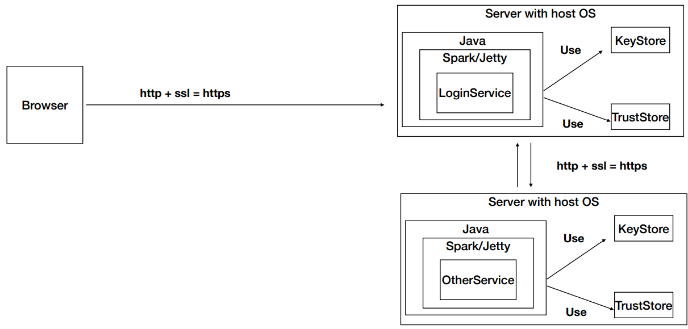

# APLICACIÓN DISTRIBUIDA SEGURA EN TODOS SUS FRENTES 

La arquitectura de la aplicación es la siguiente:



Desarrolle una aplicación Web segura con los siguientes requerimientos:

1. Debe permitir un acceso seguro desde el browser a la aplicación. Es decir debe garantizar autenticación, autorización e integridad de usuarios.
2. Debe tener al menos dos computadores comunicacndose entre ellos y el acceso de servicios remotos debe garantizar: autenticación, autorización e integridad entre los servicios. Nadie puede invocar los servicios si no está autorizado.
3. Explique como escalaría su arquitectura de seguridad para incorporar nuevos servicios.

## Getting Started

These instructions will get you a copy of the project up and running on your local machine for development and testing purposes. See deployment for notes on how to deploy the project on a live system.

### Prerequisites

* Java 8 - Development Environment
* Maven - Dependency Management
* Git - Version Control System

### Installing

1. Clonar el repositorio

```
git clone https://github.com/Juank544/AREP-LAB04.git
```

2. Instalar dependencias necesarias

```
mvn clean install
```

3. Ejecutar el proyecto
   * Con Maven
   ```
   mvn exec:java -Dexec.mainClass="co.edu.escuelaing.App"
   ```
   * Con Java
   ```
   java -cp "target/classes:target/dependency/*" edu.escuelaing.arep.HelloService
   ```


End with an example of getting some data out of the system or using it for a little demo

## Deployment

Add additional notes about how to deploy this on a live system

## Built With

* [Spark](https://sparkjava.com/) - The web framework used
* [Maven](https://maven.apache.org/) - Dependency Management
* [Java](https://www.oracle.com/co/java/technologies/javase/javase8-archive-downloads.html) - Development Environment
* [Keytool](https://docs.oracle.com/javase/7/docs/technotes/tools/windows/keytool.html) - Key and Certificate Management Utility

## Contributing

Please read [CONTRIBUTING.md](https://gist.github.com/PurpleBooth/b24679402957c63ec426) for details on our code of conduct, and the process for submitting pull requests to us.

## Authors

* **Juan Camilo Gil**  - [Juank544](https://github.com/Juank544)

## License

This project is licensed under the MIT License - see the [LICENSE](LICENSE) file for details

## Acknowledgments

* Hat tip to anyone whose code was used
* Inspiration
* etc
